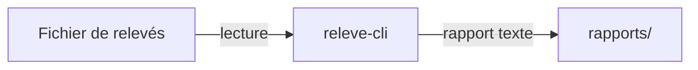

# Aide-mémoire Markdown — module Travail collaboratif & documentation technique

Bachelor 2 — Ynov Campus Nantes — 2026-2027 · Référence : CommonMark 0.31.2, plus les extensions de la plateforme (tableaux, cases à cocher, blocs Mermaid). Règle d'or : le fichier source doit rester lisible **sans** être affiché.

## 1. Les huit constructions qui suffisent

| Ce que vous écrivez | Ce que cela produit | Piège à éviter |
|---|---|---|
| `# Titre` | Titre de niveau 1 — un seul par document | Oublier l'espace après le `#` : rien ne se met en forme |
| `## Sous-titre` | Titre de niveau 2, découpe les sections | Sauter du niveau 1 au niveau 3 |
| `**gras**` | Mise en valeur forte, pour un avertissement | Tout mettre en gras : plus rien ne ressort |
| `- élément` | Liste à puces | Oublier la ligne vide **avant** la liste : elle ne se forme pas |
| `1. étape` | Liste numérotée, pour une procédure | Numéroter à la main dans le texte au lieu d'utiliser la liste |
| `` `commande` `` | Police à chasse fixe dans une phrase (fichier, commande, valeur) | Mettre des guillemets à la place : la commande devient ambiguë |
| `[texte](adresse)` | Lien cliquable vers une page ou un fichier | Écrire « cliquez ici » : le lien ne dit pas où il mène |
| `> citation` | Bloc en retrait, pour un avertissement ou un extrait | En abuser : le retrait perd son effet |

## 2. Le bloc de commandes, à copier sans réfléchir

````markdown
## Récupérer le projet

```bash
git clone https://github.com/<compte>/releve-cli-nom1-nom2.git
cd releve-cli-nom1-nom2
cp config.example.txt config.txt
```

Résultat attendu : le dossier `releve-cli-nom1-nom2` contient un fichier `config.txt`, qui n'est pas suivi par Git.
````

Trois accents graves ouvrent et ferment le bloc ; le mot qui suit (`bash`, `python`, `text`) active la coloration. **Une commande par ligne**, sans invite `$` ni commentaire mélangé au texte à copier. Toute procédure se termine par le **résultat attendu**, vérifiable par le lecteur seul.

## 3. Les tableaux

```markdown
| Réglage | Valeur par défaut | Rôle |
|---|---|---|
| CHEMIN_RELEVES | exemples/releves.csv | Fichier de relevés à traiter |
| INTERVALLE | 300 | Délai entre deux rapports, en secondes |
```

La **deuxième ligne, faite de tirets, est obligatoire** : sans elle, le tableau reste du texte brut. Les barres verticales n'ont pas besoin d'être alignées dans la source. Pour aligner une colonne : `|:---|` à gauche, `|---:|` à droite, `|:---:|` centré.

## 4. Listes imbriquées et procédures

```markdown
1. Copier `config.example.txt` en `config.txt`.
   - Ne jamais enregistrer `config.txt` dans le dépôt.
2. Renseigner le chemin du fichier de relevés.
3. Lancer `python3 releve.py --config config.txt`.
```

Trois espaces d'indentation rattachent la puce à l'étape qui la précède. Un bloc de code au milieu d'une liste numérotée s'indente de la même façon, sinon la numérotation repart à 1 après le bloc.

## 5. Liens et images

| Besoin | Syntaxe | Remarque |
|---|---|---|
| Fichier du dépôt | `[guide de démarrage](docs/demarrage.md)` | Chemin **relatif** au fichier courant : valable pour tout le monde, contrairement à `C:\Users\…` |
| Section du même fichier | `[voir Configuration](#configuration)` | Ancre = titre en minuscules, espaces remplacés par des tirets, sans accent ni ponctuation |
| Page externe | `[CommonMark](https://commonmark.org)` | Adresse complète, avec `https://` |
| Image | `` | Le texte entre crochets décrit l'image pour qui ne la voit pas |
| Issue ou PR | `#12` ou `Closes #12` | La plateforme crée le lien ; `Closes` ferme l'issue à la fusion |

## 6. Encadrés, cases à cocher, schémas

````markdown
> **Attention** : une valeur réelle publiée une fois est compromise, même supprimée ensuite.

- [ ] Prérequis écrits
- [x] Commandes dans un bloc, une par ligne
- [ ] Résultat attendu


````

Les encadrés typés du module — **Définition**, **Attention**, **Vérification** — se font avec une citation `>` ouverte par le mot en gras. Un bloc `mermaid` est rendu en schéma par la plateforme, et reste lisible comme une liste de relations si le rendu manque.

## 7. Ce que Markdown ne fait pas

- **Ni marges, ni colonnes, ni polices, ni couleurs** : Markdown décrit une structure, l'outil qui l'affiche décide de l'apparence.
- **Pas de rendu identique partout** : chaque plateforme ajoute ses extensions ; vérifiez toujours le rendu final là où le document sera lu.
- **Pas de relecture** : ni orthographe, ni cohérence, ni liens cassés. C'est le rôle du relecteur humain — et d'un clic sur chaque lien.
- **Pas de plan** : la syntaxe ne structure pas la pensée. L'ordre des sections se décide avant d'écrire.

## 8. Avant de proposer un fichier à la fusion

- [ ] Un seul `#` de niveau 1, hiérarchie sans saut de niveau.
- [ ] Une ligne vide avant chaque liste, chaque tableau, chaque bloc de code.
- [ ] Chaque bloc de code ouvert **et** fermé par trois accents graves.
- [ ] Chaque lien relatif ouvre bien le fichier visé depuis la plateforme.
- [ ] Aucun crochet `[À COMPLÉTER]` ni texte de gabarit restant.
- [ ] Aucune valeur réelle de configuration, seulement des exemples.
- [ ] Le fichier se lit encore dans un éditeur de texte brut, sans aperçu.

## 9. Nommer le fichier

Minuscules, mots séparés par des tirets, extension `.md`, sans accent ni espace : `docs/demarrage.md`, `docs/architecture.md`, `docs/adr/0001-format-du-rapport.md`. Exception : les fichiers attendus à la racine, en majuscules — `README.md`, `CHANGELOG.md`, `LICENSE`.
